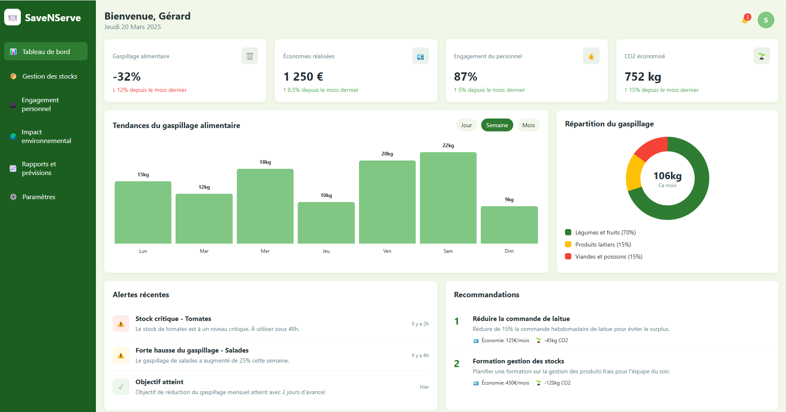
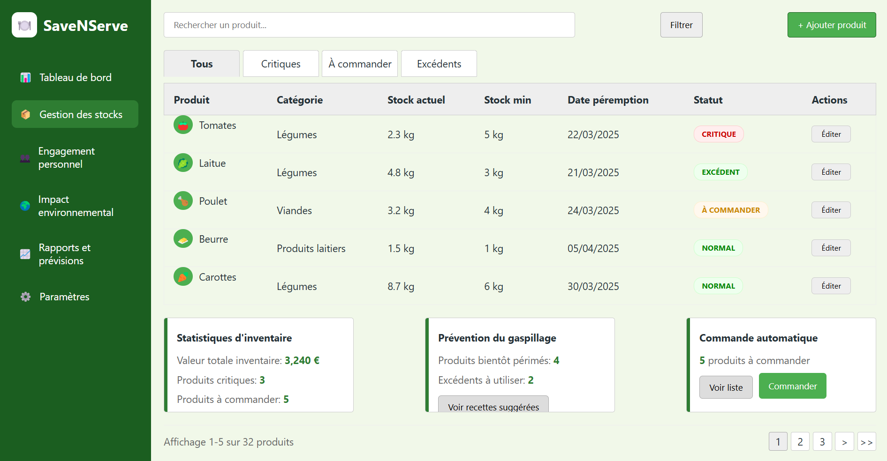
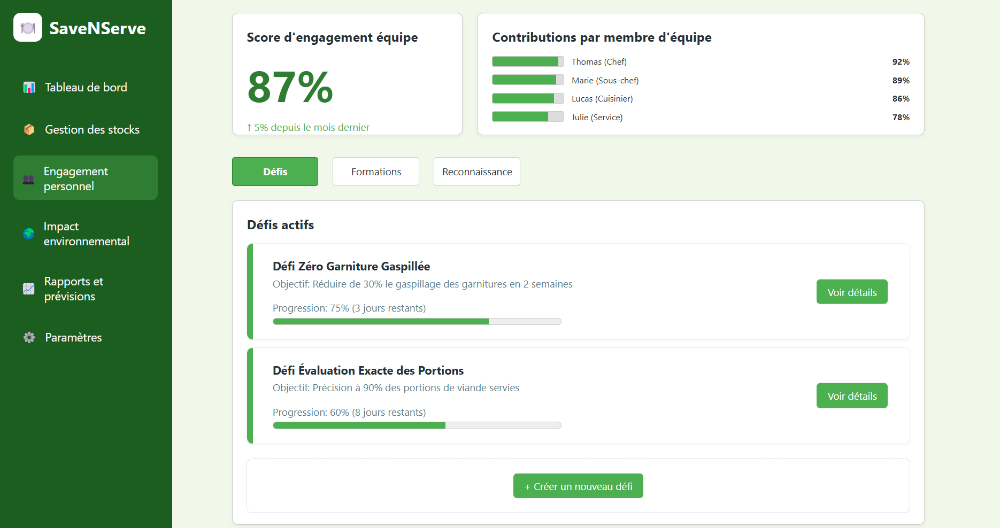
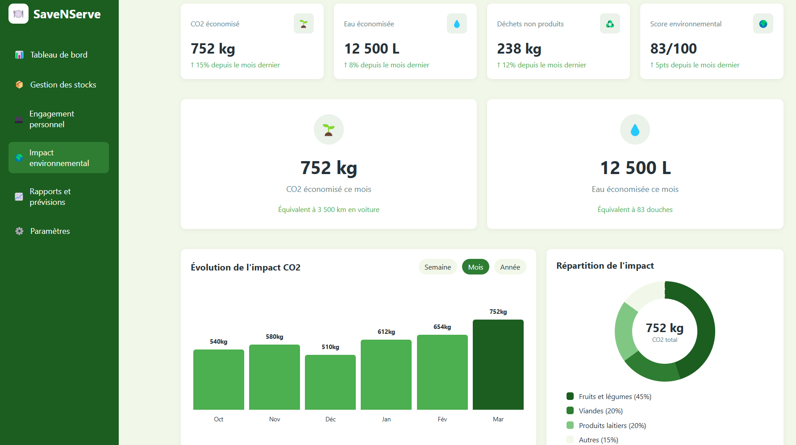
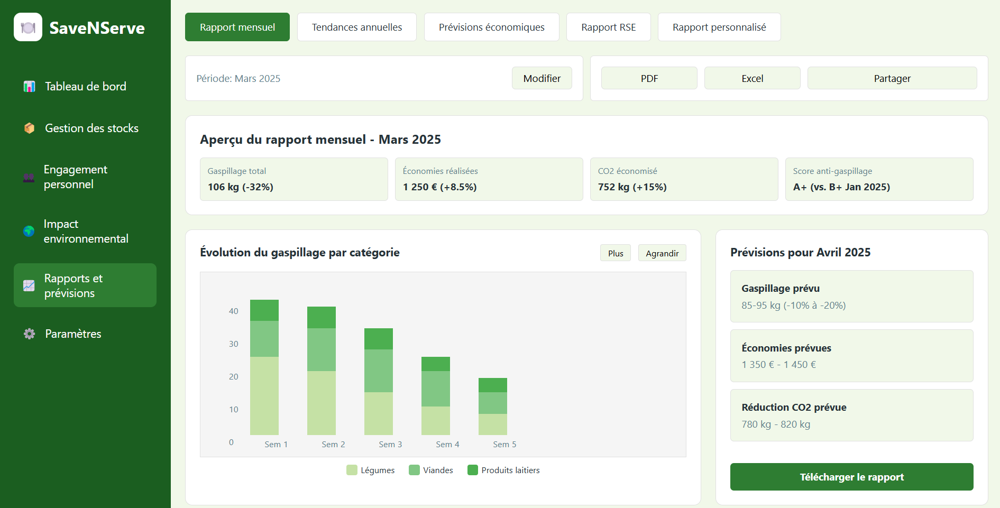

# SaveNServe

## Solution intelligente contre le gaspillage alimentaire pour la restauration professionnelle


---

## Vue d'ensemble

SaveNServe est une solution innovante conçue pour aider les professionnels de la restauration à lutter efficacement contre le gaspillage alimentaire, tout en optimisant leurs coûts d'exploitation et en réduisant leur impact environnemental.

Notre plateforme utilise l'intelligence artificielle pour analyser les tendances de consommation, prédire les besoins en approvisionnement et fournir des recommandations personnalisées aux restaurateurs, leur permettant de prendre des décisions éclairées basées sur des données précises.

---

## Problématiques adressées

Le secteur de la restauration fait face à des défis majeurs en matière de gestion durable :

1. **Gaspillage alimentaire important** : En France, la restauration professionnelle génère plus de 1,8 million de tonnes de déchets alimentaires chaque année.
   
2. **Coûts d'exploitation élevés** : Le gaspillage représente entre 5 et 15% du chiffre d'affaires des établissements.
   
3. **Impact environnemental considérable** : La production alimentaire non consommée est responsable d'émissions de CO2 importantes.
   
4. **Difficultés de sensibilisation des équipes** : L'adoption de pratiques anti-gaspillage reste un défi organisationnel.

SaveNServe apporte une solution complète à ces problématiques grâce à une approche data-driven et des outils de visualisation intuitifs.

---

## Dashboard principal



Le tableau de bord principal offre une vue synthétique des performances de l'établissement en matière de lutte contre le gaspillage alimentaire.

### Fonctionnalités clés

- **Indicateurs de performance (KPIs)** : Suivi en temps réel des progrès réalisés
  - Réduction du gaspillage alimentaire (%)
  - Économies financières réalisées (€)
  - Taux d'engagement du personnel (%)
  - Réduction d'émissions de CO2 (kg)

- **Graphique des tendances** : Visualisation hebdomadaire du gaspillage alimentaire pour identifier les pics et les jours critiques

- **Répartition du gaspillage** : Analyse détaillée par catégorie de produits (fruits et légumes, produits laitiers, viandes et poissons)

- **Alertes en temps réel** : Notifications sur les stocks critiques et les hausses inhabituelles de gaspillage

- **Recommandations intelligentes** : Suggestions d'actions prioritaires générées par notre algorithme d'IA, avec estimation des impacts financiers et environnementaux

### Aide à la décision

Le dashboard principal permet aux gestionnaires de :
- Identifier rapidement les tendances négatives nécessitant une action
- Visualiser l'impact concret des actions mises en place
- Prioriser les interventions selon leur retour sur investissement potentiel
- Communiquer facilement les progrès aux équipes

---

## Gestion des stocks



Le module de gestion des stocks est central dans la stratégie de réduction du gaspillage alimentaire.

### Fonctionnalités clés

- **Inventaire intelligent** : Suivi précis des stocks avec alertes de péremption
  
- **Prévisions d'utilisation** : Algorithmes prédictifs basés sur l'historique de consommation et les facteurs externes (saison, météo, réservations)
  
- **Optimisation des commandes** : Recommandations de quantités à commander pour minimiser le gaspillage

- **Traçabilité complète** : Suivi du cycle de vie des produits de la réception à l'utilisation

### Algorithmes et formules utilisés

```
// Formule DAX pour le calcul de la prévision de consommation
ConsommationPrévue = 
VAR HistoriqueBase = CALCULATE(
    AVERAGE('Historique'[Quantité]),
    DATESINPERIOD('Calendrier'[Date], TODAY(), -30, DAY)
)
VAR FacteurSaisonnier = 
    DIVIDE(
        CALCULATE(
            AVERAGE('Historique'[Quantité]), 
            SAMEPERIODLASTYEAR('Calendrier'[Date])
        ),
        CALCULATE(
            AVERAGE('Historique'[Quantité]), 
            DATESINPERIOD('Calendrier'[Date], TODAY(), -365, DAY)
        )
    )
VAR FacteurRéservation = 
    DIVIDE(
        'Réservations'[NombreClients],
        AVERAGE('Historique'[NombreClients])
    )
RETURN
    HistoriqueBase * FacteurSaisonnier * FacteurRéservation * 1.05 // Marge de sécurité de 5%
```

### Aide à la décision

Ce module permet de :
- Anticiper les besoins réels d'approvisionnement
- Réduire les stocks excédentaires
- Optimiser la rotation des produits
- Identifier les produits à forte tendance de gaspillage

---

## Engagement du personnel



L'implication des équipes est essentielle pour réduire durablement le gaspillage alimentaire.

### Fonctionnalités clés

- **Tableau de suivi par équipe** : Mesure de la contribution de chaque équipe aux objectifs
  
- **Système de gamification** : Challenges, objectifs et récompenses pour stimuler l'engagement
  
- **Formation continue** : Modules de sensibilisation et bonnes pratiques accessibles directement dans l'application
  
- **Communication interne** : Partage des réussites et des idées d'amélioration

### Métriques d'engagement

- Taux de participation aux initiatives anti-gaspillage
- Score d'engagement calculé à partir des actions concrètes réalisées
- Impact individuel et collectif quantifié
- Progression des connaissances via les modules de formation

### Aide à la décision

Ce module permet aux managers de :
- Identifier les équipes nécessitant plus d'accompagnement
- Reconnaître et valoriser les contributions individuelles
- Adapter les formations aux besoins spécifiques
- Créer une culture d'entreprise axée sur la durabilité

---

## Impact environnemental



Visualisation de l'empreinte écologique et des progrès réalisés en matière de développement durable.

### Fonctionnalités clés

- **Calcul de l'empreinte carbone** : Quantification des émissions évitées grâce à la réduction du gaspillage
  
- **Analyse du cycle de vie** : Impact environnemental des produits de l'approvisionnement à la gestion des déchets
  
- **Objectifs de développement durable** : Suivi des contributions aux ODD
  
- **Reporting RSE** : Génération automatique de rapports pour la communication externe

### Métriques environnementales

- Équivalent CO2 économisé (kg)
- Eau économisée (m³)
- Énergie économisée (kWh)
- Déchets évités (kg)

### Aide à la décision

Ce module permet de :
- Quantifier concrètement l'impact environnemental des actions
- Identifier les postes à fort potentiel d'amélioration écologique
- Communiquer efficacement sur les engagements RSE
- Valoriser l'image de marque auprès d'une clientèle sensible aux enjeux environnementaux

---

## Rapports et prévisions



Module d'analyse avancée pour une vision stratégique à long terme.

### Fonctionnalités clés

- **Tableaux de bord personnalisables** : Création de rapports sur mesure selon les besoins spécifiques
  
- **Analyses prédictives** : Projections basées sur les tendances historiques et les objectifs fixés
  
- **Benchmarking** : Comparaison avec les moyennes du secteur et les établissements similaires
  
- **Exportation multi-formats** : Génération de rapports PDF, Excel ou présentations PowerPoint

### Analyses avancées

```sql
/* Exemple de requête pour l'analyse prédictive du gaspillage */
WITH historical_data AS (
    SELECT date, category, quantity_wasted
    FROM waste_records
    WHERE date BETWEEN DATEADD(month, -12, GETDATE()) AND GETDATE()
),
seasonality AS (
    SELECT 
        MONTH(date) as month,
        category,
        AVG(quantity_wasted) as avg_waste
    FROM historical_data
    GROUP BY MONTH(date), category
),
forecast AS (
    SELECT 
        DATEADD(month, seq.n, GETDATE()) as forecast_date,
        s.category,
        s.avg_waste * (1 - target_reduction_rate) as predicted_waste
    FROM seasonality s
    CROSS JOIN (SELECT TOP 12 ROW_NUMBER() OVER (ORDER BY (SELECT NULL)) as n FROM sys.objects) seq
    JOIN reduction_targets r ON s.category = r.category
    WHERE MONTH(DATEADD(month, seq.n, GETDATE())) = s.month
)
SELECT * FROM forecast
ORDER BY forecast_date, category
```

### Aide à la décision

Ce module stratégique permet à la direction de :
- Planifier les objectifs à moyen et long terme
- Anticiper les tendances futures de consommation
- Mesurer le retour sur investissement des initiatives anti-gaspillage
- Préparer des communications externes basées sur des données fiables

---

## Architecture technique

SaveNServe repose sur une architecture moderne et évolutive :

- **Front-end** : Interface utilisateur intuitive développée en HTML/CSS/JavaScript avec framework React
  
- **Back-end** : API RESTful développée en Python avec Django pour la gestion des données
  
- **Intelligence artificielle** : Algorithmes de machine learning pour les prévisions et recommandations
  
- **Base de données** : Structure relationnelle optimisée pour l'analyse de données temporelles
  
- **Sécurité** : Chiffrement des données et conformité RGPD

L'ensemble de la solution est déployée sur une infrastructure cloud pour garantir performance et disponibilité.

---

## Bénéfices constatés

Les établissements utilisant SaveNServe ont constaté en moyenne :

- **30% de réduction du gaspillage alimentaire** en 6 mois
- **15% d'économies** sur les coûts d'approvisionnement
- **25% de réduction de l'empreinte carbone** liée à l'alimentation
- **85% d'engagement des équipes** dans la démarche anti-gaspillage
- Retour sur investissement en moins de 4 mois


